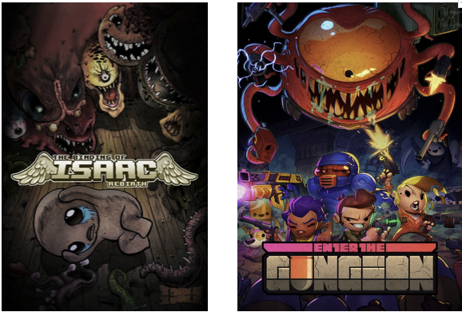

# 1st-Project-Rogue-Like-Game

For my first project at General Assembly I was given the freedom to build a game of my choice using grid, `JavaScript`, `HTML` and `CSS`. I have a passion for indie games, in particular the roguelike genre, so that's what I chose. 

“Roguelike is a subgenre of role-playing computer games traditionally characterised by a dungeon crawl through procedurally generated levels, turn-based gameplay, grid-based movement, and permanent death of the player character.”

The deployment of the game can be found here: [Roguelike](https://rafaelvsoares.github.io/1st-Project-Rogue-Like-Game/)

---

## Why roguelike?

My inspiration to make my own game was The Binding of Isaac and Enter the Gungeon.

Key features from both games:
* Procedural generated levels, items, monsters, etc
* You can shoot/kill monsters.
* Tests your reflex skills
* Items synergies
* Bugs and more bugs which makes the gameplay even more interesting

## MPV

#### What to expect:
> * At least 1 monster with basic movement and attacks
> * Player that can shoot
> * Pickup items
> * Be able to get points

#### If MVP is achieved here are a couple of different ideas that could be implemented:
> * Use canvas to have a free movement including diagonal movement
> * Add boss battle
> * Add music/sounds
> * Main menu
> * Highscore submission board
> * Different items to pickup and use

# Things to fix
    1. The bullets don't register on the monster when he is on the last cells. ✅
    2. Fix the order of the functions, so they work accordingly ✅
    3. Monster projetile ticks twice ✅
    4. When player is removed from screen monster's projetiles aren't removed ✅
    5. You can skipp projectiles if timed right. Leave it in as a feature ✅
    6. Figure out how to only use one function to shoot projectiles for player

**Collision for Items**

    1. Bomb ✅
    2. Heart ✅
    3. Coin ✅

**Bomb**

    1. Ticks 3 seconds ✅
    2. Destroys Items
    3. Damage Player ✅
    4. 9 pixel radius explosion ✅

**Infinite Enemy spawn**

    Maybe make a function to check a certain condition is met for when the monster is dead/alive infinitely. ✅