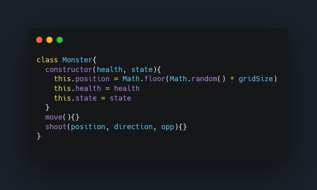

  
  
  

# Intro

For my introductory project at General Assembly, I was tasked to design and build a grid-based web browser game using `HTML`, `CSS`, and `JavaScript` I had been learning for the past five weeks. The project was a solo assignment with a one-week deadline.

With over 500 hours spent playing "The Binding of Isaac" and "Enter The Gungeon" on Steam, I was inspired to create a game in my favourite genre, "Rogue-Like". This genre has many topics to explore and learn from, such as procedural generated levels and enemies. However, one week wasn’t enough time for me to learn these concepts so I chose to keep it simple. The main objective was to challenge the player's reflexes and skill by having them eliminate as many enemies as they can whilst dodging projectiles and collecting items.

The deployment of the game can be found here: [Roguelike](https://rafaelvsoares.github.io/1st-Project-Rogue-Like-Game/)

---

## Technology Used
- `JavaScript`
- `CSS`
- `HTML`
- `Git`
- `Github`
- `Excalidraw`

## Technical Requirements
- Render a game in the browser
- Design logic for winning & visually display which player won
- Include separate `HTML`/`CSS`/JavaScript files
- Stick with KISS (Keep It Simple Stupid) and DRY (Don’t Repeat Yourself) principles
- Use JavaScript for DOM manipulation
- Deploy your game online, where the rest of the world can access it
- Use semantic markup for `HTML` and `CSS` (adhere to best practices)

## Planning
I chose to begin by sketching in Excalidraw to visualise the appearance of the game and to draft the fundamental variables and functions that will be required.

## MVP (minimal value product)
1. The presence of at least one monster with basic movement patterns and attacks.
2. The player's ability to shoot.
3. The option to pick up items.
4. The capability to collect coins.

## Setting up the grid

The grid class was established to facilitate manipulation of its size through the use of a for loop and a few variables, allowing for quick and easy adjustments. Ultimately, a 10x10 grid was determined to be the optimal size. It was important to keep in mind that the grid must be a multiple of 10 as the collision logic for the player and enemies movement only functions with multiples of 10. The loop below will nest a div element into the grid class depending on the grid size.

## Functions

Initially, I opted to write my code solely using functions. However, I encountered an issue when attempting to access variables from different functions. The problem was due to the limited scope of functions, which prevented me from accessing the required information. Thus, I made the decision to shift to using classes as their scope is more flexible and enables me to access the code from external sources more easily.

## Classes

### Player
I then decided to implement my code using classes, instead of solely relying on functions, in order to overcome the limitations of variable scope in functions. I created a class for the player that contains all the necessary logic. When instantiating the player class, three constructor arguments can be passed in: position, health, and score. 

The `position` argument specifies the location of the player on the screen, and the number must fall within the grid size. The `health` and `score` arguments determine the starting values for the player's health and points. The player class includes three methods that accept a browser event as a parameter, which allows it to respond to user inputs through the keyboard in the browser. These inputs are essential for interacting with the player character.

### Enemy

The enemy class was created with its own unique movement and shooting logic. The monster is designed to move and shoot independently and has two constructor parameters, `health` and `state`. The `health` parameter determines the starting health points of the monster, while the `state` parameter specifies whether the monster is alive or dead. The monster class also includes a default `position` variable to define the starting `position` of the monster on the screen, which is randomly generated within the grid.

### Enemy Movement

Unlike the player's class, the functions within the monster class don't depend on a web browser event for movement. Instead, a basic algorithm was used to determine the monster's movement, based on the `monsterAi` variable, which generates a number between 0 and 3 whenever the function is run. After the monster moves, the `shoot` method is called as a callback function.

### Items

In addition, an Item class was created to work together with the enemy class. This class has a parameterless constructor but includes two variables: `gold` and `health`. Initially, these variables were intended to serve as identifiers or IDs to spawn items in the grid, but they are not strictly necessary. Nevertheless, they are functional.

The Item class has four methods. The `RandomDrop` method is a straightforward algorithm that generates a number between 1 and 3, with 1 and 2 representing `gold` and `health`, and 3 calling a callback function for the `bomb` function. The remaining two functions are used for collision detection to determine if the player has collected the item.

### Event Listeners and Intervals

Finally, all of the classes were instantiated and event listeners and intervals were added to start the game. Unfortunately, due to time constraints, the `location.reload` function had to be used to reset the game.

## Wins and Challenges

The first challenge I encountered was when I wasn’t following the DRY rule (don’t repeat yourself). This was noticed by my instructor and they challenged me to refactor the logic for the shooting for the monster class. This took me 2 days to complete which was not ideal as I only had 1 week to complete the game.

### First version

### Second Version

The second version has three parameters: `position`, `direction`, and `opp`. The `position` parameter identifies the location of the monster and serves as a reference point for the bullets, while the `position` variable is reused to track the bullet's location on the grid. The `direction` parameter determines the path the bullet should follow (e.g., right, left, down, up). The `opp` parameter is used to determine the appropriate operator to make the bullet move in the correct direction.

To animate the bullet, a `setInterval` method with a speed of 100 milliseconds is utilised. This updates the bullet's position every 100 milliseconds until either a collision with the player or the end of the grid occurs, causing the interval to be cleared.

### Bomb

On the last few days of the project I decided to add a new item to the game as a personal challenge. The item is inspired by the troll bomb from the game "The Binding of Isaac". This item is unique because it explodes when picked up and damages the player. The hardest part was figuring out the best algorithm to prevent the explosion's sprite from going beyond the boundaries of the game board, as that would cause the game to break. I know the code isn't optimal but it works for now.

### Enemy Spawn

Another challenge I faced was generating a new enemy each time one was defeated. Initially, I didn't know how to implement this using a class, so I implemented a quick fix by using two functions outside the `Monster` class. The `monsterAlive` function checks if the monster is still alive or has been defeated. If it has been defeated, it triggers a callback function to the `monsterDead` function, which sets the monster's state back to `alive`. This creates an infinite loop, controlled by the monster's `state` variable.

This solution, although it worked, was not what I originally intended for the game. My goal was to generate a new instance of the enemy each time one was defeated. Despite this, the hotfix allowed me to reach the minimum viable product, as my time for this project had come to an end.

## Key Learnings/Takeaways

Reflecting on this project, I can see how much I have grown in my software engineering journey. The code I wrote now seems suboptimal, and I question why I didn't approach it differently to save myself time. I am now more confident in manipulating the DOM using plain JavaScript. I also learned that when working on a solo project, it's crucial to properly plan the project and have a realistic expectation of the final outcome.

## Bugs

### Bug 1 

One major bug in the game is that if you defeat an enemy and repeatedly press the start button, the enemy sprite will become nearly invincible, similar to a boss battle in Dark Souls. To resolve this issue, I could disable the start button once it's been pressed. However, the same bug can occur if the player hits the enemy before it has fully appeared on the board. This is because of the way the enemy was coded; it is never truly defeated and immediately moves to a random cell within the grid after being hit. If the player shoots the cell where the monster is located, it will trigger the bug.

### Bug 2
There is also another bug in the game that acts as a test of the player's timing skills. This bug enables the player to avoid the enemy's bullet by moving towards it at the right time, when both the player and the bullet are next to each other. While this is not the intended behaviour, I do not plan on fixing it, as it adds an interesting exploit mechanic to the game.

## Future Improvements

* Implementing the use of a canvas for smooth, unrestricted movement, including diagonal movement.
* Adding challenging boss battles.
* Integrating music and sound effects.
* Developing a main menu for the game.
* Setting up a high score submission board.
* Including various pick-up items with unique abilities.
* Resolving the bug where the monster is nearly unkillable.
* Implementing a limited bullet count for the player.
* Creating a procedurally generated map.
* Refactoring the monster class to be reusable for different types of monsters.
* Encapsulating the functions that check if the monster is dead or alive within the monster class.
* Making the game reset without requiring a full page refresh.
* Adding an ending to the game.
* Allowing character selection.
* Improving player instructions.
* Upgrading the monster AI to make them more challenging.